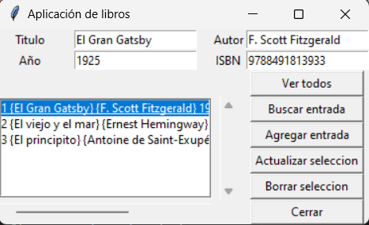

# Gestión de Libros 📚

Este proyecto es una aplicación de escritorio simple para gestionar libros, desarrollada en Python utilizando **Tkinter** para la interfaz gráfica y **SQLite** para la base de datos.

## Propósito del Proyecto

Este proyecto fue desarrollado como parte del curso **"The Python Mega Course: Build 10 Real World Applications"** en Udemy. Su objetivo principal es practicar el lenguaje Python y las bibliotecas que se utilizan en el desarrollo de aplicaciones de escritorio. Además, es una forma de reforzar conceptos como la conexión a bases de datos y la interacción entre un frontend y un backend.

---

## Características

- **Ver todos los libros:** Muestra todos los libros registrados en la base de datos.
- **Buscar un libro:** Permite buscar libros por título, autor, año o ISBN.
- **Agregar un libro:** Agrega nuevos libros a la base de datos.
- **Actualizar un libro:** Actualiza la información de un libro seleccionado.
- **Eliminar un libro:** Borra un libro de la base de datos.
  - incluye confirmación antes de borrar.
- **Cerrar la aplicación:** Cierra la interfaz gráfica.
- **Manejo de errores:**
  - Notificación si se intenta eliminar o actualizar sin seleccionar un registro.

## Requisitos

- Python 3.8 o superior
- Paquetes utilizados:
  - `tkinter` (incluido en Python)
  - `sqlite3` (incluido en Python)

## Instalación y Uso

### 1. Clona este repositorio o descarga los archivos.

### 2. Crear el ejecutable (opcional)

Si deseas generar un ejecutable:

1. Instalar PyInstaller

    ```bash
    pip install pyinstaller
    ```
2. Genera el ejecutable:

    ```bash
    pyinstaller --onefile --noconsole app.py
    ```
    El archivo ejecutable estará en la carpeta `dist/.`

### 3. Ejecutar aplicación 

Puedes ejecutar la aplicación directamente con Pytho:

```bash
python frontend.py
```

## Estructura del proyecto

```bash
gestion-de-libros/
│
├── frontend.py      # Frontend y lógica de la interfaz gráfica encapsulada en una clase
├── backend.py       # Backend (clase Database para conexión con SQLite)
├── README.md        # Documentación del proyecto
├── libros.db        # Base de datos SQLite (se crea automáticamente)
└── .gitignore       # Ignora archivos innecesarios (build/, dist/, etc.)
```

## Funcionalidades principales

| Botón                | Descripción                                        |
| -------------------- | -------------------------------------------------- |
| Ver todos	           | Muestra todos los registros de la base de datos.   |
| Buscar entrada       | Busca libros por título, autor, año o ISBN.        |
| Agregar entrada      | Añade un nuevo libro a la base de datos.           |
| Actualizar selección | Modifica un libro seleccionado.                    |
| Borrar selección     | Elimina un libro seleccionado de la base de datos. |
| Cerrar               | Cierra la aplicación.                              |

### Backend
El backend está implementado en el archivo `backend.py` y utiliza SQLite como base de datos. Ahora, el backend se organiza en una clase llamada `Database`. Para utilizarlo, debes importar la clase y crear una instancia con el nombre del archivo de la base de datos. Ejemplo:

```python
from backend import Database

# Crear instancia de la base de datos
db = Database("libros.db")

# Métodos disponibles
db.insertar("Titulo", "Autor", 2024, 123456)
libros = db.ver()
print(libros)
```

#### Métodos de la clase `Database`
- `inicializar()`: Crea la tabla `libros` si no existe.
- `insertar(titulo, autor, anio, isbn)`: Inserta un nuevo libro en la base de datos.
- `ver()`: Retorna todos los registros de la tabla.
- `buscar(titulo="", autor="", anio="", isbn="")`: Busca registros en la base de datos.
- `eliminar(id)`: Elimina un registro por su `id`.
- `actualizar(id, titulo, autor, anio, isbn)`: Actualiza un registro existente.


### Captura de pantalla



## Contribución

Este proyecto no está pensado para uso comercial ni como un producto terminado. Es únicamente un ejercicio de aprendizaje. Sin embargo, si deseas realizar mejoras, puedes:

* Hacer un fork del repositorio.
* Realizar tus cambios en una nueva rama.
* Enviar un pull request con una descripción clara de tus cambios.